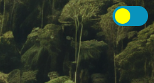

# site-agrinho-2024

Um site voltado a fomentar a discussão sobre algo que pode mudar o país, do campo à cidade.

## como acessá-lo

Há três formas de utilizar este site, sendo elas: via Vercel, via Github Pages ou baixando os arquivos do site.
O acesso das duas primeiras formas se encontra na seção "Sobre" (ou em inglês, About) ou podem ser acessados clicando nos links abaixo:
- [GitHub Pages](https://eggsbennedit.github.io/site-agrinho-2024/)
- [Vercel](https://site-agrinho-2024.vercel.app/)

## como usá-lo

Ao entrar no site, o usuário verá diversos elementos textuais e imagens. Ao acessar este site através de um computador ou notebook, é possível ver um efeito de ampliação das imagens ao passar o cursor do mouse por cima delas, recurso não disponível em plataformas mobile por ser difícil para o usuário colocar em prática o efeito com a mesma suavidez.
No canto superior direito da tela sempre haverá um interruptor que, ao ser clicado, ativará ou desativará o modo noturno, dependendo do modo atual.

